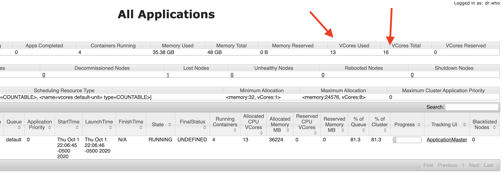
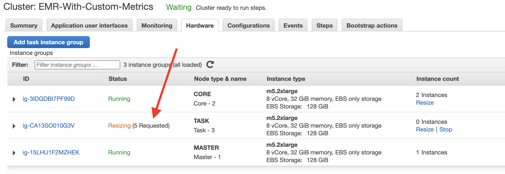
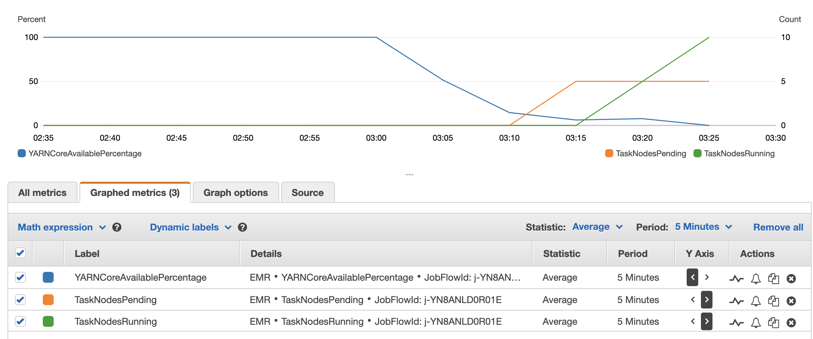

# Amazon EMR Automatic Scaling with Custom Metrics

This writeup is to demonstrate how you can use feed additional metrics from your Amazon EMR cluster and later use
 those metrics to configure [automatic scaling](https://docs.aws.amazon.com/emr/latest/ManagementGuide/emr-automatic
 -scaling.html). Ideally, for YARN-based application, [EMR Managed Scaling](https://docs.aws.amazon.com/emr/latest
 /ManagementGuide/emr-managed-scaling.html) can handle the majority of the scaling needs. However, if your application
 doesn't run on YARN or you want to use custom metrics, you can follow this solution to get an idea how you can achieve that.
  
Note: ⚠️ Please use this solution as a reference, do not use this solution in production without testing and
 configuring based on your use case.

## Pushing Additional Metrics from Amazon EMR to AWS CloudWatch

Amazon EMR Automatic Scaling policy is dependent on CloudWatch metrics, so if you want to  scale out and scale in
core node and task nodes based on a specific value, that value needs to be pushed to CloudWatch. Once, the CloudWatch
 receives that value, then you can write the automatic scaling policy using those values. In this example
, I'm using YARN Core Available Percentage to configure my autoscaling policy. You can check [Monitor Metrics with CloudWatch](https://docs.aws.amazon.com/emr/latest/ManagementGuide/UsingEMR_ViewingMetrics.html) to see the list of available
 EMR metrics on CloudWatch. I'm using core percentage just for an example, you can use any other value depending on
  your requirement. 
     
I have a bash script [custom-metrics.sh](scripts/custom-metrics.sh) that executes on the EMR cluster master node
 every 30 seconds through a cron job. Inside the script, I'm leveraging [ResourceManager REST
 API’s](https://hadoop.apache.org/docs/r2.8.5/hadoop-yarn/hadoop-yarn-site/ResourceManagerRest.html) to get YARN
  metrics. From all the metrics, I am parsing two different data points **availableVirtualCores** and
   **totalVirtualCores** to calculate the **YARNCoreAvailablePercentage** value. Once I get the value, I use
    [AWS CLI](https://aws.amazon.com/cli/) to publish the value to CloudWatch.

``` bash
#!/bin/bash
set -x -e

REGION=`cat /tmp/aws-region`
HOSTNAME=`cat /tmp/hostname`

RESPONSE=`curl -s $HOSTNAME:8088/ws/v1/cluster/metrics`
CLUSTER_ID=`ruby -e "puts '\`grep jobFlowId /mnt/var/lib/info/job-flow.json\`'.split('\"')[-2]"`

AVAILABLE_CORE=`echo $RESPONSE | jq -r .clusterMetrics.availableVirtualCores`
TOTAL_CORE=`echo $RESPONSE | jq -r .clusterMetrics.totalVirtualCores`
CORE_AVAILABLE_PERCENTAGE=$(echo "scale=2; $AVAILABLE_CORE *100 / $TOTAL_CORE" | bc)

aws cloudwatch put-metric-data --metric-name YARNCoreAvailablePercentage --namespace AWS/ElasticMapReduce --unit
 Percent --value $CORE_AVAILABLE_PERCENTAGE --dimensions JobFlowId=$CLUSTER_ID --region $REGION
```

You can check CloudWatch metrics to find the newly delivered YARNCoreAvailablePercentage metric data. This metric
 will be used in the automatic scaling policy to scale the cluster. As you see in the following picture, the new
 metric YARNCoreAvailablePercentage is showing up along with the existing metric YARNMemoryAvailablePercentage.


## Setting up the Custom Metrics
I am using [EMR Bootstrap Action (BA)](https://docs.aws.amazon.com/emr/latest/ManagementGuide/emr-plan-bootstrap.html
) to set up the custom metrics job on the EMR master node. BA executes the script [setup-custom-metrics.sh](scripts
/setup-custom-metrics.sh) which downloads the custom-metrics.sh script from Amazon S3 and configure the cron job to
 execute that script every 30 seconds.


## Using Custom CloudWatch Metrics to configure EMR Automatic Scaling
As of now (EMR 5.30.1), you cannot use or configure custom metrics through the EMR console. The only way to use custom
 metrics to configure EMR automatic scaling is to launch the EMR cluster using AWS CLI. I'm using a separate JSON file [instance-group-config.json](config/instance-group-config.json) to pass the instance
 groups configuration and [configuration.json](config/configuration.json) file to update the default YARN calculator
. Please change the configuration file based on your requirement. Here is the snippet of the configuration file
 where I'm using the custom metric value - **YARNCoreAvailablePercentage** to configure scale-out & scale-in policy
. For scale-out, when YARNCoreAvailablePercentage <= 25, it will add 5 nodes to the cluster. For scale-in, when
 YARNCoreAvailablePercentage > 75, then it will reduce the cluster size by 2.

```json
"Rules":
[
     {
        "Name":"scale-out-yarn-available-core-percentage",
        "Description":"Scale-out policy",
        "Action":{
           "SimpleScalingPolicyConfiguration":{
              "AdjustmentType":"CHANGE_IN_CAPACITY",
              "ScalingAdjustment":5,
              "CoolDown":300
           }
        },
        "Trigger":{
           "CloudWatchAlarmDefinition":{
              "Dimensions":[
                 {
                    "Key":"JobFlowId",
                    "Value":"${emr.clusterId}"
                 }
              ],
              "EvaluationPeriods":1,
              "Namespace":"AWS/ElasticMapReduce",
              "Period":300,
              "ComparisonOperator":"LESS_THAN_OR_EQUAL",
              "Statistic":"AVERAGE",
              "Threshold":25,
              "Unit":"PERCENT",
              "MetricName":"YARNCoreAvailablePercentage"
           }
        }
     },
     {
        "Name":"scale-in-yarn-available-core-percentage",
        "Description":"Scale-in policy",
        "Action":{
           "SimpleScalingPolicyConfiguration":{
              "AdjustmentType":"CHANGE_IN_CAPACITY",
              "ScalingAdjustment":-2,
              "CoolDown":300
           }
        },
        "Trigger":{
           "CloudWatchAlarmDefinition":{
              "Dimensions":[
                 {
                    "Key":"JobFlowId",
                    "Value":"${emr.clusterId}"
                 }
              ],
              "EvaluationPeriods":1,
              "Namespace":"AWS/ElasticMapReduce",
              "Period":300,
              "ComparisonOperator":"GREATER_THAN",
              "Statistic":"AVERAGE",
              "Threshold":75,
              "Unit":"PERCENT",
              "MetricName":"YARNCoreAvailablePercentage"
           }
        }
     }
]
```
## Demo: Automatic Scaling with Custom Metrics
Here is the AWS CLI that I'm using to launch the EMR cluster. I'm passing the autoscaling policies through the
 parameter *--instance-groups*. Please make sure to update the following command based on your AWS environment:
```bash
aws emr create-cluster --release-label emr-5.30.1 --name 'EMR-With-Custom-Metrics' \
--applications Name=Hadoop Name=Spark Name=Hive Name=Tez Name=Ganglia \
--bootstrap-actions Path=s3://aws-data-analytics-blog/emr-custom-metrics/setup-custom-metrics.sh,Name=SetupCustomMetrics \
--ec2-attributes '{"KeyName":"<<your-key-name>>","InstanceProfile":"EMR_EC2_DefaultRole","SubnetId":"<<your-subnet-id>>"}' \
--service-role EMR_DefaultRole --auto-scaling-role EMR_AutoScaling_DefaultRole \
--instance-groups file://./config/instance-group-config.json \
--configurations file://./config/configuration.json \
--log-uri <<your-s3-log-path>>
```

Once the cluster is ready, you can verify the autoscaling policy on the Amazon EMR console.


You will notice that the size of the Task node will reduce from 2 to 0. When the cluster is ready and no jobs
 are running, all vCore will be available, so the **YARNCoreAvailablePercentage** will be 100%. In the **scale-in**
 policy, we trigger scale-in for the Task node when **YARNCoreAvailablePercentage > 75**. So, after this scale-in
  process, EMR cluster is ready with 1 Master node and 2 Core nodes.
  

                       
Now, log in to the EMR master node and submit a Spark job by using the command given below. This Spark job
 reads Amazon review data in TSV format from Amazon S3, calculates total number of product category and finally converts the data
 into Parquet and writes back to S3. This job will request > 40 Spark executors to process the data. The goal for this Spark job is
 to increase the YARN vCore usage, which will trigger the custom **scale-out** policy. You can also execute this
 command multiple times to see a dramatic scale-out and scale-in process.

```bash
spark-submit --name "SparkJob" --deploy-mode cluster --conf spark.dynamicAllocation.minExecutors=55 \
--conf spark.dynamicAllocation.initialExecutors=55 \
s3://aws-data-analytics-blog/emr-custom-metrics/spark_converter.py \
s3://amazon-reviews-pds/tsv/ <<s3-output-location>>
```
You can verify the increased vCore usage from the Resource Manager UI. On this picture, you see that 13 VCores are
 being used out of 16:



After 5 minutes, you will notice that the cluster is requesting additional 5 Task nodes:



From the CloudWatch console, you can check which scaling rule is in **In alarm** state:


Once the resize process is completed, 5 additional Task nodes will be running, which will increase YARN vCore
 availability. You can verify that through Resource Manager UI. On the CloudWatch console, you can monitor custom
 metrics status and scale-in & scale-out actions. In the following figure, the blue line represents
 YARNCoreAvailablePercentage value, and it drops from 100 to below 10. Within few moments, scale-out kicks in and new
 additional nodes are added to the cluster. Green line represents the Task nodes count, which increased from 0 to 15.
 
 

## Considerations
- This solution is just for a reference, it's not built or tested for production workload. Please configure and test
 before running this solution in production.
- As of now (EMR 5.30.1), custom metrics cannot be used from the Amazon EMR console. You need to use AWS CLI to
 launch the cluster.
- You cannot clone an existing cluster that uses custom metrics-based autoscaling, it will break the automatic
 scaling configuration.
- Automatic scaling cannot be changed or de-attached from an existing cluster that uses custom metrics. The only way
to apply a new automatic scaling policy is to create a new cluster.
